<div align="center">



# ascii-multimeter

Un multímetro digital 3D renderizado con caracteres ASCII, girando 360° y midiendo **115.0 V~** (corriente alterna, 60 Hz).

</div>

## Cómo funciona

El multímetro no está dibujado a mano: es un modelo 3D construido con funciones de distancia,
inspirado en un multímetro de bolsillo clásico: carcasa naranja, panel gris, LCD azul
retroiluminado, botones H y de luz, selector rotativo en **V~ 200**, jacks 10A / COM / VΩmA,
puntas de prueba conectadas y soporte trasero. Para cada uno de los 36 ángulos
de la vuelta, `multimeter.py` lanza un rayo por carácter (*ray marching* con numpy), calcula la
iluminación de la superficie que toca y la traduce a un carácter de la rampa de ese material.
El LCD es una textura con una fuente de 3×5 y la serigrafía del panel (OFF, V~, V=, A, Ω, °C,
10A, COM, VΩmA) son caracteres reales pegados a la superficie, así que giran con el modelo.

Los frames se empaquetan en un único SVG animado con CSS, así que funciona en cualquier README
de GitHub sin JavaScript ni GIFs.

## Uso

```bash
pip install -r requirements.txt

py multimeter.py            # regenera multimeter.svg y multimeter-terminal.svg
py multimeter_cli.py        # lo hace girar en la terminal (Ctrl+C para salir)
py multimeter_cli.py --fps 15
```

La versión de terminal necesita una ventana de al menos 84×62 caracteres y usa colores de 24 bits (cmd y PowerShell en Windows 10/11, Windows Terminal,
o cualquier terminal moderna). La primera ejecución tarda unos segundos en calcular los frames;
después se cargan desde caché.

## Personalizar

- **Lectura del display:** `READING` en `multimeter.py` (dígitos, `.`, espacio, `V` y `~`).
- **Posición de la perilla:** `POINTER_DEG`.
- **Serigrafía del panel:** `build_decals()`.
- **Colores:** el diccionario `COLORS`; el SVG y la versión de terminal lo comparten.
- **Velocidad y suavidad:** `FRAMES` y `DURATION`.

---

<div align="center"><sub>Hecho por <a href="https://github.com/tavoMend">Gustavo Mendoza</a></sub></div>
